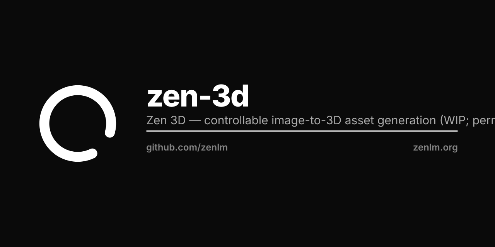

# Zen 3D

Controllable image-to-3D asset generation.

> **Status: work in progress.** Built on a permissive, commercially-licensed foundation (no non-commercial or restricted-weight dependencies). The Zen model is not yet trained/integrated here — this provides the licensing, attribution, and integration scaffold.

## Foundation
Built on **Pixal3D** (TencentARC, MIT) and **TRELLIS** (Microsoft, MIT) — chosen for permissive, commercial-friendly licensing.

## License
MIT License — see [LICENSE](LICENSE) and [NOTICE](NOTICE). Copyright 2025-2026 Zen Authors (https://zenlm.org).

## Roadmap
- [ ] Wire the permissive foundation as the generation backbone
- [ ] Train / fine-tune the Zen variant
- [ ] Inference, evaluation, and release
